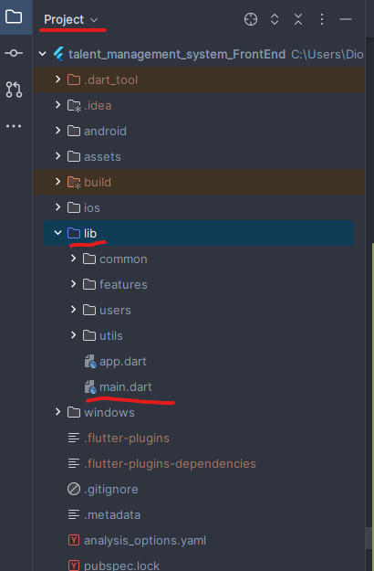

# After this Introduction section you have the project setup help.

# Project
Name: TMS(Talent Management System)

# Back-End
Repo: https://github.com/dionisio-miron-a22204982/DEISI-16-BackEnd.git

# Authors
Name: Dionísio Miron. 
StudentID: a22204982.
University: ULHT (Universidade Lusófona de Humanidades e Tecnologias)
Course: LEI (Licenciatura em Engenharia Informática).

# Apresentação e Divulgação
A presença da Internet e ‘Softwares’ no nosso quotidiano permitiu transformar tarefas que costumavam demorar meses, semanas e dias em poucos minutos. Este avanço das tecnologias abriu portas para uma melhor interação entre as empresas e os candidatos, facilitando o envio de anúncios diretamente para as redes sociais onde a população está mais concentrada. O aparecimento dos dispositivos móveis abriu imensas possibilidades de negócio, mas principalmente de ferramentas para apoiar empresas e impulsionar a evolução das tecnologias humanitárias. As entrevistas antigamente eram um processo demorado e, além disso, o candidato devia deslocar-se até à sede da empresa. Com o surgimento de aplicações CV Tool Management, o processo foi completamente revolucionado. Neste mesmo contexto, onde o recrutamento e a seleção de candidatos são cruciais para o sucesso das organizações, tais ferramentas desempenham um processo crucial para o sucesso das organizações. Esta aplicação permite facilitar o primeiro contacto, crucial em muitos empregos.

# Project Origin
In the course I'm studying, Computer Engineering, in the third year, in the second semester, you have to do a final course work, which in turn represents 20 ECTS (that's a lot).
So I was given a list where I could choose the project I wanted to do, and this particular one really caught my eye, because it tackles a real problem, which is the recruitment process.

Problems in the company recruitment process:
-> Long waiting times for a response.
-> Difficult to find.
-> Sometimes even a big waste of time.
-> Accessibility.
-> Waste of talent.

So I applied myself to this job to show that I can combat a real problem, that I can do a project that can shape my professional career and also make a difference.
After a long wait, Professor Rui Ribeiro accepted my proposal and awarded me the job.

# Special Thanks and mentions
As the developer of this solution, I have to say that it wasn't an easy task, but I didn't give up and 
I always had the support of colleagues, friends, teachers and experts in the field.
It gives me great pleasure to mention these people and say from the bottom of my heart "Thank you for everything!".

# Teachers:
->  (Mentor)(Teacher) Rui Ribeiro - As my mentor, he was always available and helped me create the project. An experienced teacher in the field of business and management.
->          (Teacher) Pedro Alves - An experienced teacher in the technologies I used in the project, he helped me a lot with technical problems.

# Colleagues and Friends:
->(Friend)(Colleague) Sofia Caldas - Queen of the backend, very dedicated and very good and expert in the backend especially.
->(Friend)(Colleague) Diogo Rodrigues - Very good programmer and dedicated, a great inspiration to change my routines.
->(Friend)(Colleague) Alexandre Santos - Excellent programmer, fun and with lots of out-of-the-box ideas.
->(Friend)(Colleague) Miguel Silva - He is the king of connections, IPs and all kinds of connections.
->(Friend)(Colleague) Bernardo Taciano - Dedicated, ambitious, a good friend, an excellent programmer and one of the best students in the class, what a pride! (He made me read, and now it's become a habit).
->(Friend)(Colleague) Rodrigo Pinto - The first person I met when I joined the course, he forced me to study programming and changed my mentality throughout my academic career, 
it was thanks to him that I took the initiative to become a better student.
->(Friend)(Colleague) Rodrigo Taciano - A great friend, committed, intelligent when he wants to be, very good at chess and the only master I know at LOL.

# Close Friends:
-> (Close Friend) João Silva - One of my best and closest friends, the one who gives me opinions on design and features, a great friend I've known for 7+ years.
-> (Close Friend) Jéssica Simões - One of my best and closest friends, the one who gives me opinions on images, she's a professional photographer, a great friend I've known for 7+ years.

# Expert 
-> (Expert)(Youtuber) Coding With T - https://www.youtube.com/@CodingwithT - Experienced Dart programmer who helped me understand Flutter and have good practices and organization in my projects.
-> (Expert)(Youtuber) Net Ninja - https://www.youtube.com/@NetNinja - Experienced programmer in several programming languages, someone who knows how to explain things effectively and who can keep up with the times.

# ---------------
# Project Setup (PT)
Deve ter Git ou GitHub app no computador.

Inicialmente basta seguir este tutorial, que se encontra disponível no seguinte link:
https://www.youtube.com/watch?v=X4iEy_wBxho&ab_channel=DeveloperRitesh
(Não se esqueça de deixar like :D)

Problemas com Dark.sdk:
https://www.youtube.com/watch?v=jTdNT35TKVE&ab_channel=Goodknowledge
(Não se esqueça de deixar like :D)

O computador deve estar no modo programador, devido à criação de uma native splash screen.
Para tal deve ir às definições do windows -> procurar "programador" -> selecionar a opção "Utilizar as funcionalidades de programador" e ligar o "Modo Programador".
(Desta maneira pode descarregar o splash screen).

Após conclusão do tutorial acima, basta criar: New -> Project from version Control... -> Colar o https do projeto.

Depois disso abra as seguinte pastas no Project:
lib -> main.dart

Selecione Update Depedencies e Get Depedencies.

Depois crie um telemóvel seguindo este tutorial:
https://www.youtube.com/watch?v=q-3r85fl-g4&ab_channel=LazyTechNo

E para terminar dê Run'main.dart'.

# Project Setup (EN)
You must have a Git or GitHub app on your computer.

Initially, just follow this tutorial, which is available at the following link:
https://www.youtube.com/watch?v=X4iEy_wBxho&ab_channel=DeveloperRitesh
(Don't forget to leave a like :D)

Problems with Dark.sdk:
https://www.youtube.com/watch?v=jTdNT35TKVE&ab_channel=Goodknowledge
(Don't forget to leave a like :D)

The computer must be in programmer mode, due to the creation of a native splash screen.
To do this, go to windows settings -> search for "developer" -> select the option "Use developer features" and turn on "Developer mode".
(This way you can download the splash screen).

Once you have completed the above tutorial, simply create: New -> Project from version Control... -> Paste the project https.

Then open the following folders in the Project:
lib -> main.dart

Select Update Depedencies and Get Depedencies.

Then create a cell phone following this tutorial:
https://www.youtube.com/watch?v=q-3r85fl-g4&ab_channel=LazyTechNo

And to finish Run'main.dart'.

# Notas para testers
User particular Root -> username:'admin' password:'Admin123!'.
User empresarial Root -> username:'Rui' password:'Rui123!'.

Tambem pode criar o seu próprio User.

Enjoy and have fun ;)

